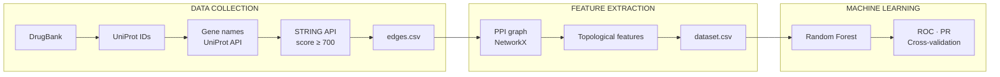

# Automated Identification of Pharmacological Drug Targets via PPI Network Topology
 
**Master's Thesis (TFM) — MSc Bioinformatics, VIU**  
**Author:** Nina Dudikova  
**Year:** 2026
 
---
 
## Overview
 
This project implements a computational pipeline for the automated identification of candidate drug targets using protein-protein interaction (PPI) network topology and machine learning. Known drug targets are retrieved from DrugBank; their interaction networks are downloaded from STRING; topological features are computed with NetworkX; and a Random Forest classifier is trained to distinguish drug targets from non-targets.
 
---
 
## Pipeline
 

 
---
 ## Repository structure
 
```
.
├── 01_data/
│   ├── drugbank_approved_target_polypeptide_sequences.fasta.zip
│   └── protein.fasta
├── 03_results/
│   ├── resultados.txt
│   ├── edges.csv
│   ├── targets.csv
│   ├── dataset.csv
│   ├── modelo.joblib
│   ├── curva_roc.png
│   └── curva_precision_recall.png
├── 01_data_collection.py
├── 02_graph_features.py
├── 03_random_forest.py
├── 04_model_validation.py
├── requirements.txt
└── README.md
```
 
---
 
## Requirements
 
- Python 3.10+
- See `requirements.txt` for the full list of dependencies
Install dependencies:
 
```bash
pip install -r requirements.txt
```
 
Key packages: `pandas`, `requests`, `networkx`, `scikit-learn`, `matplotlib`, `joblib`
 
---
 
## Data sources
 
| Source | Version / Access | Purpose |
|---|---|---|
| [DrugBank](https://go.drugbank.com/) | Approved targets FASTA (manual download, account required) | Known drug target UniProt IDs |
| [STRING](https://string-db.org/) | API v11, *H. sapiens* (taxon 9606), confidence ≥ 700 | PPI interaction data |
| [UniProt](https://www.uniprot.org/) | REST API | UniProt ID → gene name conversion |
 
> **Note:** The DrugBank FASTA file requires a free registered account. Download `drugbank_approved_target_polypeptide_sequences.fasta.zip` and place it in the root directory before running step 1.
 
---
 
## Usage
 
Run each script in order from the root directory:
 
```bash
# Step 1 — Data collection (~45–50 min)
python 01_data_collection.py
 
# Step 2 — Graph feature computation (~45 min)
python 02_graph_features.py
 
# Step 3 — Random Forest training and evaluation
python 03_random_forest.py
 
# Step 4 — Stratified cross-validation
python 04_model_validation.py
```
 
Results are written incrementally to `03_results/resultados.txt`.
 
---
 
## Methods summary

### Data collection
Known drug targets were retrieved from DrugBank in FASTA format. UniProt IDs were extracted from the sequence headers and converted to gene names via the UniProt REST API, processing entries in batches of 100. PPI data for each target were downloaded from the STRING database (human proteome, taxon ID 9606, confidence threshold ≥ 700), and all interactions were consolidated into a single edge list.
 
### Network construction
PPI interactions were retrieved from STRING for each known drug target (confidence threshold ≥ 700, human proteome). The resulting network was built as an undirected weighted graph using NetworkX.
 
### Features
Five topological metrics were computed per protein node:
 
| Feature | Description |
|---|---|
| Degree | Number of direct interaction partners |
| Clustering coefficient | Tendency of a node's neighbours to be interconnected |
| Betweenness centrality | Frequency with which a node lies on shortest paths between other nodes |
| Closeness centrality | Mean proximity of a node to all other nodes in the network |
| PageRank | Importance score weighted by the importance of interaction partners |
 
### Classification
A Random Forest classifier (100 estimators, `class_weight="balanced"`, `random_state=42`) was trained on an 80/20 train–test split. Class imbalance between known drug targets (positive class) and the remaining network proteins (negative class) was handled via balanced class weighting.
 
### Evaluation
Model performance was assessed using the classification report, confusion matrix, ROC-AUC, precision-recall curve (average precision), and 5-fold stratified cross-validation.
 
---
 
## License
 
This project was developed for academic purposes as part of a Master's thesis. Code is provided for reproducibility. Data from DrugBank and STRING are subject to their respective terms of use.
